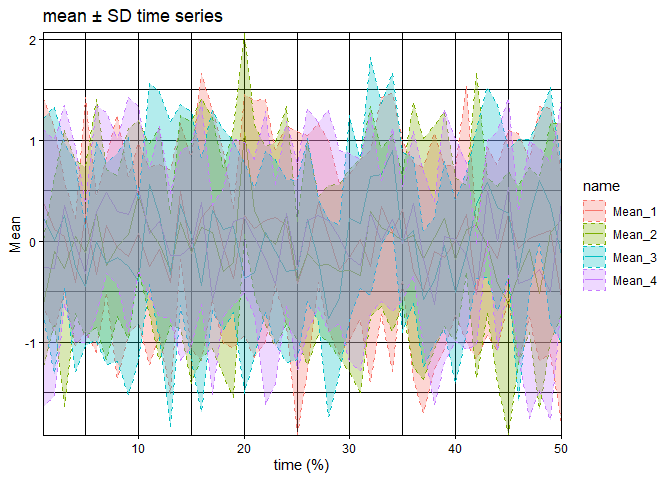
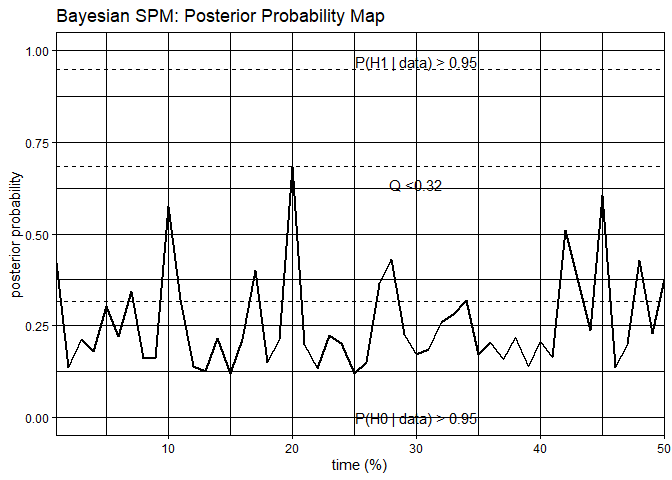

# BayesSPM

<!-- badges: start -->

[](https://github.com/LindaAmoafo/BayesSPM/actions/workflows/R-CMD-check.yaml)
<!-- badges: end -->

The BayesSPM package helps to implement SPM analysis for 2 groups and
multiple groups using Bayesian inference, particularly the Bayes factor
approach in the Bayesian school of thoughts.

## Installation

You can install the development version of BayesSPM like so:

``` r
devtools::install_github("LindaAmoafo/BayesSPM")
```

## Example

This is a basic example which shows you how to solve a common problem:

``` r
## Simulate some dataset
Y = mvtnorm::rmvnorm(40,mean=rep(0,50))
grp=rep(c(1,2,3,4),each=10)
time=1:50
```

**Run the SPMBayes function**

``` r
library(BayesSPM)
out <- SPMBayes(Y,group=grp, time, threshold=0.95, Q.threshold=0.05, Hypothesis="alt")
head(summary(out))
```

    ## No significance at the specified Q-value setting to a Q-value = 0.3154751 that has at least 1 significant timepoint

**Generate summary plot**

``` r
plot(x=out, summary = TRUE) ## Get summary plot
```

<!-- --> **Generate
SPM probability Maps and check significance**

``` r
plot(x=out, summary = FALSE) ## Get SPM Map plot
```

<!-- -->
